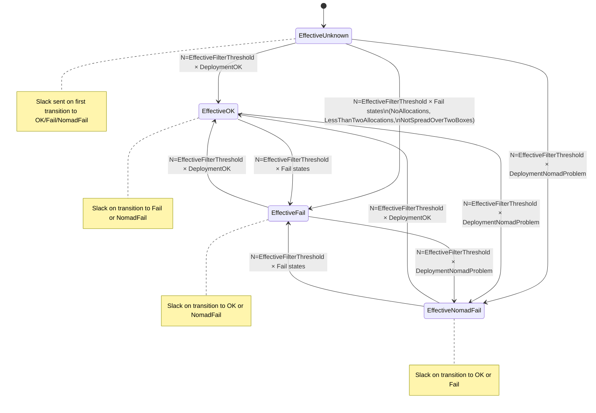

# web-mount spread checker checker transitions

```mermaid
stateDiagram-v2
    [*] --> EffectiveUnknown

    EffectiveUnknown --> EffectiveOK: N=EffectiveFilterThreshold × DeploymentOK
    EffectiveUnknown --> EffectiveFail: N=EffectiveFilterThreshold × Fail states\n(NoAllocations, LessThanTwoAllocations,\nNotSpreadOverTwoBoxes)
    EffectiveUnknown --> EffectiveNomadFail: N=EffectiveFilterThreshold × DeploymentNomadProblem

    EffectiveOK --> EffectiveFail: N=EffectiveFilterThreshold × Fail states
    EffectiveOK --> EffectiveNomadFail: N=EffectiveFilterThreshold × DeploymentNomadProblem

    EffectiveFail --> EffectiveOK: N=EffectiveFilterThreshold × DeploymentOK
    EffectiveFail --> EffectiveNomadFail: N=EffectiveFilterThreshold × DeploymentNomadProblem

    EffectiveNomadFail --> EffectiveOK: N=EffectiveFilterThreshold × DeploymentOK
    EffectiveNomadFail --> EffectiveFail: N=EffectiveFilterThreshold × Fail states

    note right of EffectiveUnknown
      Slack sent on first transition to OK/Fail/NomadFail
    end note
    note right of EffectiveOK
      Slack on transition to Fail or NomadFail
    end note
    note right of EffectiveFail
      Slack on transition to OK or NomadFail
    end note
    note right of EffectiveNomadFail
      Slack on transition to OK or Fail
    end note

```